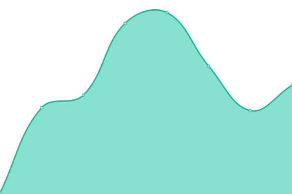

# [📈 Live Status](https://status.rajlabs.in): <!--live status--> **🟧 Partial outage**

This repository contains the open-source uptime monitor and status page for [Raj Dubey](https://rajlabs.in), powered by [Upptime](https://github.com/upptime/upptime).

<!--start: status pages-->
<!-- This summary is generated by Upptime (https://github.com/upptime/upptime) -->
<!-- Do not edit this manually, your changes will be overwritten -->
<!-- prettier-ignore -->
| URL | Status | History | Response Time | Uptime |
| --- | ------ | ------- | ------------- | ------ |
|  [Rajlabs](https://rajlabs.in) | 🟩 Up | [rajlabs.yml](https://github.com/authoritydmc/uptime-status/commits/HEAD/history/rajlabs.yml) | 

 89ms
     
 | 

<a href="https://status.rajlabs.in/history/rajlabs">100.00%</a>
    

|  [Rajlabs Tools Site](https://utility.rajlabs.in) | 🟩 Up | [rajlabs-tools-site.yml](https://github.com/authoritydmc/uptime-status/commits/HEAD/history/rajlabs-tools-site.yml) | 

 139ms
     
 | 

<a href="https://status.rajlabs.in/history/rajlabs-tools-site">100.00%</a>
    

|  [Nginx @ Homelab](https://sites.rajlabs.in/) | 🟥 Down | [nginx-homelab.yml](https://github.com/authoritydmc/uptime-status/commits/HEAD/history/nginx-homelab.yml) | 

 78ms
     
 | 

<a href="https://status.rajlabs.in/history/nginx-homelab">0.00%</a>
    

<!--end: status pages-->

[**Visit our status website →**](https://status.rajlabs.in)

## 📄 License

- Powered by: [Upptime](https://github.com/upptime/upptime)
- Code: [MIT](./LICENSE) © [Anand Chowdhary](https://anandchowdhary.com), supported by [Pabio](https://pabio.com)
- Data in the `./history` directory: [Open Database License](https://opendatacommons.org/licenses/odbl/1-0/)
